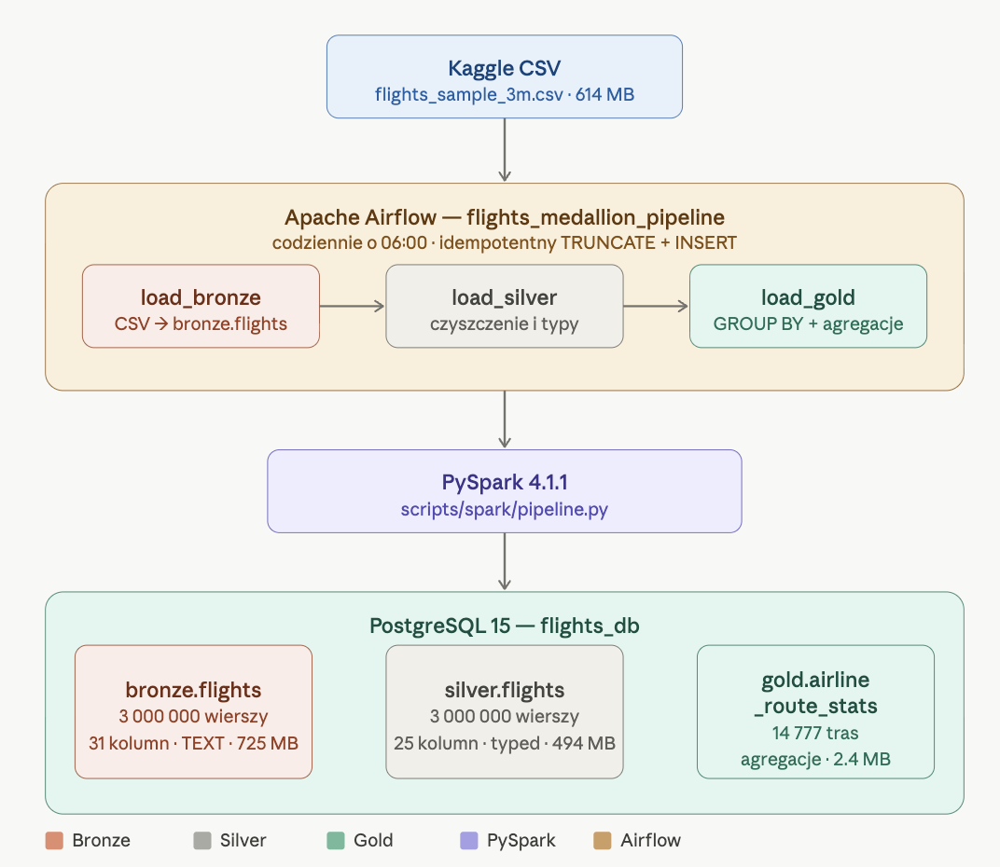

# ✈️ US Flight Delays - Data Engineering Project

## Problem Statement

This project analyzes US domestic flight delays and cancellations (2019-2023)
to identify which airlines and routes have the worst on-time performance.
The goal is to build a reliable data pipeline using the Medallion Architecture
(Bronze → Silver → Gold) that transforms raw flight data into actionable analytics.

**Key analytical question:**
*Which airlines and routes have the highest average arrival delays
and cancellation rates?*

---

## Architecture

The project follows the **Medallion Architecture** orchestrated by Apache Airflow
and processed by PySpark:

| Layer | Schema | Description |
|---|---|---|
| Bronze | `bronze.flights` | Raw data loaded 1:1 from CSV, all columns as TEXT |
| Silver | `silver.flights` | Cleaned data: correct types, NaN → NULL, deduplication |
| Gold | `gold.airline_route_stats` | Aggregated route statistics, GROUP BY airline + route |



---

## Tech Stack

- **Database:** PostgreSQL 15 (Docker)
- **Processing Engine:** PySpark 4.1.1
- **Orchestration:** Apache Airflow 3.2.0
- **Language:** Python 3.12, SQL
- **Tools:** Git, Docker, VS Code

---

## Idempotency

Every pipeline layer uses **TRUNCATE + INSERT** instead of DROP + CREATE.
This means re-running the pipeline is always safe:
- Table schema and indexes are preserved
- Data is replaced cleanly without side effects
- Both the Spark pipeline and the legacy SQL scripts are idempotent

---

## How to Run

### 1. Requirements

- Docker Desktop
- Python 3.12+
- Java 17+ (required for PySpark)

### 2. Download the dataset

Download the dataset manually from Kaggle:
👉 https://www.kaggle.com/datasets/patrickzel/flight-delay-and-cancellation-dataset-2019-2023

Place the file in `data/raw/flights_sample_3m.csv`

### 3. Setup environment

```bash
python3 -m venv venv
source venv/bin/activate
pip install psycopg2-binary pandas pyspark apache-airflow
```

### 4. Install Java 17 (required for PySpark)

```bash
brew install openjdk@17
export JAVA_HOME=$(brew --prefix openjdk@17)
export PATH="$JAVA_HOME/bin:$PATH"
```

### 5. Start PostgreSQL

```bash
docker run --name postgres_db \
  -e POSTGRES_USER=admin \
  -e POSTGRES_PASSWORD=admin123 \
  -e POSTGRES_DB=flights_db \
  -p 5432:5432 -d postgres:15
```

### 6. Create the database

```bash
docker exec -it postgres_db psql -U admin -d mydatabase -c "CREATE DATABASE flights_db;"
```

### 7a. Run via PySpark (recommended)

```bash
# Full pipeline
python3 scripts/spark/pipeline.py

# Selected layers only
python3 scripts/spark/pipeline.py silver gold
```

### 7b. Run via legacy SQL scripts (batch mode)

```bash
# Bronze
python3 scripts/load_bronze.py

# Silver
docker cp sql/silver/create_silver_flights.sql postgres_db:/tmp/create_silver_flights.sql
docker exec postgres_db psql -U admin -d flights_db -f /tmp/create_silver_flights.sql

# Gold
docker cp sql/gold/create_gold_flights.sql postgres_db:/tmp/create_gold_flights.sql
docker exec postgres_db psql -U admin -d flights_db -f /tmp/create_gold_flights.sql
```

### 8. Run via Airflow (orchestrated)

```bash
export AIRFLOW_HOME=~/airflow
export AIRFLOW__CORE__DAGS_FOLDER=$(pwd)/dags
airflow standalone
```

Open http://localhost:8080 and trigger `flights_medallion_pipeline` DAG.

---

## Data Quality Risks

See [docs/data_quality_risks.md](docs/data_quality_risks.md)

---

## Repository Structure

```
flights-data-project/
├── dags/
│   └── flights_pipeline_dag.py     ← Airflow DAG
├── data/
│   └── raw/                        ← CSV files (not tracked by Git)
├── docs/
│   ├── architecture_v2.png
│   └── data_quality_risks.md
├── scripts/
│   ├── spark/
│   │   └── pipeline.py             ← PySpark pipeline (single entry point)
│   └── load_bronze.py              ← Legacy batch loader
├── sql/
│   ├── silver/
│   │   └── create_silver_flights.sql
│   └── gold/
│       └── create_gold_flights.sql
├── .gitignore
└── README.md
```